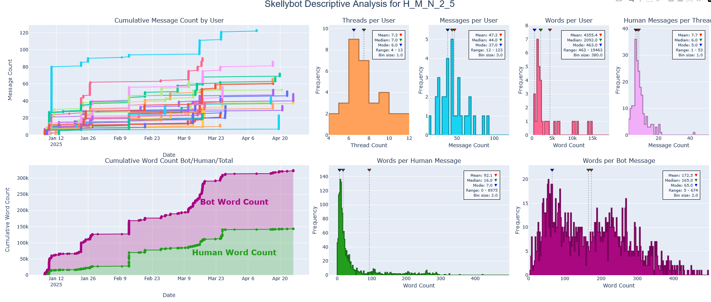
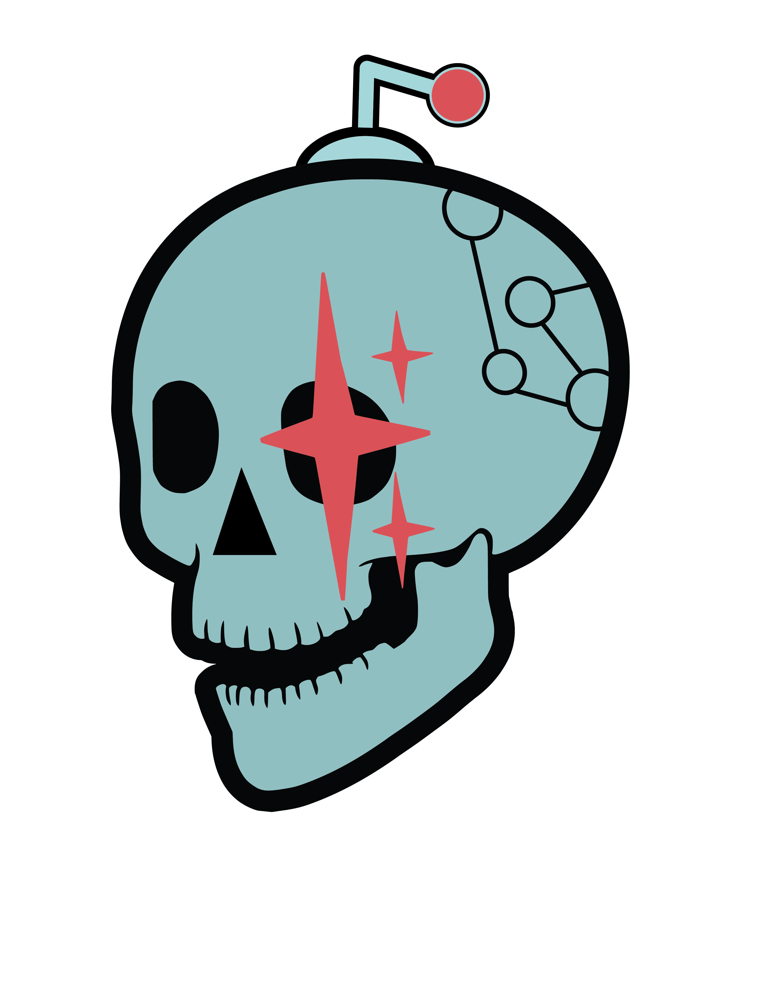

<!--
BUILD INSTRUCTIONS
==================
npm install -g @marp-team/marp-cli

HTML (for presenting, supports video embeds):
  marp freemocap-2026-state-of-the-skelly.md -o slides.html --html

PDF (for sharing, no video):
  marp freemocap-2026-state-of-the-skelly.md -o slides.pdf --html --allow-local-files

Live preview:
  marp -w freemocap-2026-state-of-the-skelly.md --html

Presenting: Open HTML in browser, F=fullscreen, P=presenter view

VIDEO TIME CONTROLS:
===================
YouTube iframe:  ?start=SECONDS (e.g. ?start=90 for 1:30)
                 ?start=30&end=120 (play 0:30 to 2:00)
                 
Local video:     #t=START,END (e.g. #t=30,120)
                 #t=45 (just start at 45 seconds)

REQUIRED LOCAL FILES:
====================
- skelly-logo.png
- skellycam-logo.png
- freemocap-github-star-history.png
- freemocap-user-dashboard.png

VIDEOS TO DOWNLOAD (use yt-dlp):
================================
- first-public-post-2021-01-19.mp4    (from x.com/JonMatthis/status/1351531974364688385)
- meowmaline-2021-07-21.mp4           (from x.com/JonMatthis/status/1417864732749582337)
- purple-monkey-2022-03-11.mp4        (optional - can use YouTube embed)
- rough-cut-tutorial-2022-11.mp4      (optional - can use YouTube embed)
- v2-announcement-2026.mp4            (from x.com/freemocap/status/2010845786007875659)

TODO - FILL IN METRICS:
======================
Search "[FILL:" in this file to find placeholders for:
- Twitter/X engagement stats (views, likes, retweets, replies)
- YouTube video stats (views)
- Get these from Twitter Analytics and YouTube Studio
-->

<!-- _class: title -->

# 2026 State of the Skelly Address

## FreeMoCap Foundation

*Start: 6:30 PM  ·  Talk: 45-60 min  ·  Q&A to follow*

---

# Agenda

1. **Background** — An abbreviated history
2. **Current State** — Numbers, financials, clients
3. **Future Plans** — v2, curriculum, shop, FDA, Blender

---

<!-- _class: title -->

# Part I
## Background

---
<!-- _class: part-background -->

# 2017 — OpenPose Happens

<!-- Add local video here: openpose-ut-video.mp4 -->

---
<!-- _class: part-background -->

# 2019 — Northeastern

Started at Northeastern University

*One year of regular professorship before...*

<!-- Video options: retinal-optic-flow.mp4, trents-argp.mp4 -->

---
<!-- _class: part-background -->

# 2020 — COVID!

### March 2020 - Quarantine!

### August 2020 - Lost faith in the scientific/academic/educational process

*...whoops!*

---
<!-- _class: part-background -->

# 2021 — Academic to FOSS Zealot

> *"The Open Source community is what the scientific community pretends to be"*

---
<!-- _class: part-background -->

# 2021 Jan 19 — First Public Post

  <video src="media/videos/first-public-post-2021-01-19.mp4" controls style="max-height: 45vh;"></video>

Source:  https://twitter.com/JonMatthis/status/1351531974364688385

---
<!-- _class: part-background -->

# 2021 July 21 — Meowmaline 🐱

  <video src="media/videos/meowmaline-2021-07-21.mp4#t=0" controls style="max-height: 45vh;"></video>

Source: https://twitter.com/JonMatthis/status/1417864732749582337 

---
<!-- _class: part-background -->

# 2022 March 11 — "This is FreeMoCap"

The purple monkey video 🐒

  <iframe 
    width="560" 
    height="315" 
    src="https://www.youtube.com/embed/WW_WpMcbzns?start=0" 
    frameborder="0" 
    allow="accelerometer; autoplay; clipboard-write; encrypted-media; gyroscope; picture-in-picture" 
    allowfullscreen>
  </iframe>

---
<!-- _class: part-background -->

# 2022 November — Rough Cut Tutorial

  <iframe 
    width="560" 
    height="315" 
    src="https://www.youtube.com/embed/GxKmyKdnTy0?start=0" 
    frameborder="0" 
    allow="accelerometer; autoplay; clipboard-write; encrypted-media; gyroscope; picture-in-picture" 
    allowfullscreen>
  </iframe>

  <strong>[FILL: XX,XXX]</strong> views

<!-- Change ?start=0 to desired start time in seconds -->

---
<!-- _class: part-background -->

# 2023 November — v1.0 Release! 🎉

The first official stable release

---
<!-- _class: part-background -->

# 2024-2025 — Public Pause to slow growth

### Strategy: Circle the Wagons

- Worried we were growing to fast
- De-emphasized public posting to slow the growth curve 
- Focused energy on Discord community

---
<!-- _class: part-background -->

# 2026 — Re-Emergence!

v2 is coming! 🚀

  <video src="media/videos/recent_treadmill_vid.mp4" controls style="max-height: 45vh;"></video>

Source: https://twitter.com/freemocap/status/2010845786007875659 

---

<!-- _class: title -->

# Part II
## Current State

---
<!-- _class: part-current -->

# By the Numbers

| Metric | Count |
|--------|-------|
| ⭐ GitHub Stars | 4,533 |
| 💬 Discord Members | 3,387 |
| 🌐 Global Users | 10,222+ |
| 🗺️ Countries Reached | 140 |

- A field trip to Dataland - https://freemocap.org/data.html
---
<!-- _class: part-current -->

# Financials
- Doing Ok
- Will survive past the 2026 June 30 Scary Cliff
- ...but will we thrive??

---
<!-- _class: part-current -->

# Clients

### Current Research Partners

- Ben Scholl - Colorado University, Denver Anschutz Campus   - Developmental Laser Ferrets  - 

- Diego Fernandez - Cincinati Children's Hospital Medical College - Mouse eye tracker and all-day Pupilometry 

  <iframe 
    width="560" 
    height="315" 
    src="https://www.youtube.com/watch?v=haRITKNkGQw" 
    frameborder="0" 
    allow="accelerometer; autoplay; clipboard-write; encrypted-media; gyroscope; picture-in-picture" 
    allowfullscreen>
  </iframe>

---
<!-- _class: part-current -->

# Now Offering Paid Service Contracts

**Knowledge is Free, Labor is unbelievable expensive** 

Contact us for: 
- Contract or consultant work: https://freemocap.org/services
- Bronze/Silver/Gold/Corporate Sponsorship (a la Blender): https://opencollective.com/freemocap-foundation

---

<!-- _class: title -->

# Part III
## Future Plans

https://github.com/orgs/freemocap/projects/34

---
<!-- _class: part-future -->

# v2 Transition 🚀

- On the `/development` branches of `freemocap` and sub-skellies (see https://github.com/freemocap )

### Release Plan
- **Pre-Alpha** - Known busted 
    - (My bad UI - `freemocap/freemocap-ui`)
- **Alpha** —  Possibly working 
    - (Pooya's good ui! https://freemocap.vercel.app)
- **Beta** — Potentially working
- **Full Release** — Probably working!

---
<!-- _class: part-future -->

# v2 Data Model Plans

### SkEP #1: Tidy Data CSVs + Parquet db

(SkEP: "Skelly Enhancement Proposal")

---
<!-- _class: part-future -->

# Documentation Overhaul, aka... 
### FreeMoCap University 🎓

- Multi-track curriculum with micro-certificatiions
- AI Slop version available here: https://github.com/freemocap/university

---
<!-- _class: part-future -->

# Skellybot Coming soon to a server near you

https://github.com/freemocap/skellybot

  
    

---
<!-- _class: part-future -->

# SkellyShop 🛒

### Charuco Boards

- Available now — print-on-demand
- Annoying, slow, expensive system, but it exists!

https://shop.freemocap.org

### Cameras and other hardware

Coming soon!

---
<!-- _class: part-future -->

# FreeMoCap Validation

### Aaron's Dissertation - Defending Soon!
👇 watch this space
https://aaroncherian.github.io/freemocap_validation/ 
https://github.com/freemocap/freemocap_validation

### FDA 510(k) Certification from there... 

---
<!-- _class: part-future -->

# Blender Addon

### Rebranding

`FreeMoCap Blender Addon` → **SkellyBlender**

### Official Distribution

🎯 Goal: Be Available in Blender's official Extension page

https://github.com/freemocap/freemocap_blender_addon/issues/45

---

<!-- _class: title -->

# Thank You!

## Questions?
info åt freemocap.org

🌐 freemocap.org  ·  💻 github.com/freemocap  ·  💬 discord.gg/freemocap